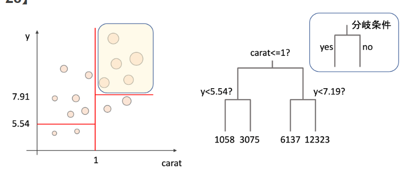

# 🎯 高機能カウンターWebアプリケーション

[](https://www.python.org)
[](https://flask.palletsprojects.com/)
[](LICENSE)

Flaskで構築された高度なWebベースカウンターアプリケーション。モダンなガラスモーフィズムUIデザイン、メモリ機能、リアルタイム統計追跡を搭載。



## ✨ 主な機能

### 🎨 モダンUIデザイン
- **ガラスモーフィズムデザイン**: 美しい半透明インターフェースとバックドロップブラー効果
- **グラデーション背景**: カウンター値に応じて変化する動的カラーグラデーション
- **レスポンシブレイアウト**: デスクトップとモバイルデバイスで完璧に動作
- **スムーズアニメーション**: より良いユーザー体験のためのホバー効果とトランジション

### 🔢 カウンター操作
- **基本操作**: インクリメント（+1）、デクリメント（-1）、リセット
- **ステップ制御**: カスタムステップ値（1-1000）で永続的な設定
- **クイックアクション**: ±10と±100の高速ボタン
- **色分けされた値**: 
  - 🟡 ゼロの場合は黄色
  - 🟢 正の数の場合は緑色
  - 🔴 負の数の場合は赤色

### 🧠 メモリシステム
- **3つのメモリスロット**: 最大3つの異なる値を保存（M1、M2、M3）
- **Store機能**: 現在のカウンター値をメモリに保存
- **Recall機能**: メモリからカウンターを復元
- **メモリ加算（M+）**: 現在の値を保存されたメモリに追加
- **全クリア**: すべてのメモリスロットを一度にリセット

### 📊 リアルタイム統計
- **総クリック数**: すべてのボタン操作を追跡
- **最大/最小値**: 到達した最高値と最低値を監視
- **セッションタイマー**: HH:MM:SS形式でのリアルタイム経過時間
- **プログレスバー**: カウンター値の視覚的表現（最大100まで）
- **ライブ更新**: タイマーは毎秒自動更新

### 📝 操作履歴
- **操作ログ**: タイムスタンプ付きで最新50操作を追跡
- **詳細記録**: 操作タイプ、値、時刻を表示
- **スクロール可能履歴**: 読みやすい操作タイムライン

## 🚀 クイックスタート

### 前提条件
- Python 3.10以上
- Flask 3.1+

### インストール

1. **リポジトリをクローン**
   ```bash
   git clone https://github.com/smitsu32/TestFile01.git
   cd TestFile01
   ```

2. **依存関係をインストール**
   ```bash
   pip3 install flask
   ```

3. **アプリケーションを実行**
   ```bash
   python3 main/main.py
   ```

4. **ブラウザを開く**
   ```
   http://localhost:5000
   ```

## 🎮 使用方法

### 基本操作
1. **インクリメント**: `➕ Add`をクリックして1増加
2. **デクリメント**: `➖ Subtract`をクリックして1減少
3. **リセット**: `🔄 Reset`をクリックしてカウンターを0に設定

### クイックアクション
- `+100`: カウンターに100を追加
- `+10`: カウンターに10を追加
- `-10`: カウンターから10を減算
- `-100`: カウンターから100を減算

### ステップ制御
1. 入力フィールドでカスタムステップ値（1-1000）を設定
2. カスタム値で`+ Step`と`- Step`ボタンを使用
3. ステップ値は操作間で永続化

### メモリ機能
1. **Store**: 現在の値をメモリスロット（M1、M2、またはM3）に保存
2. **Recall**: メモリスロットからカウンターに値をロード
3. **M+**: 現在のカウンター値をメモリスロットに追加
4. **Clear All Memory**: すべてのメモリスロットを0にリセット

## 📁 プロジェクト構造

```
TestFile01/
├── main/
│   └── main.py          # メインFlaskアプリケーション
├── img/
│   └── hyouhongi.png    # アプリケーションスクリーンショット
├── test_mat/            # MATLABテストファイル
│   ├── dispatchPrice.mat
│   ├── test.m
│   └── test2.m
├── README.md            # このファイル
├── manual.md            # 追加ドキュメント
├── manual1.xlsx         # Excelドキュメント
└── sub_manual.md        # 補足マニュアル
```

## 🛠️ 技術詳細

### バックエンド（Flask）
- **フレームワーク**: Flask 3.1+
- **ルート**: すべての操作のためのRESTful APIエンドポイント
- **状態管理**: カウンター、メモリ、履歴のためのグローバル変数
- **リアルタイムデータ**: 動的更新のためのJSONレスポンス

### フロントエンド（HTML/CSS/JavaScript）
- **レスポンシブデザイン**: CSS GridとFlexboxレイアウト
- **モダンCSS**: バックドロップフィルター、グラデーション、アニメーション
- **JavaScript**: 非同期操作のためのFetch API
- **自動更新**: タイマー更新とオプションのページ更新

### 主要機能の実装
- **メモリ永続化**: セッション中のサーバーサイドストレージ
- **履歴追跡**: タイムスタンプ付きの最新50操作
- **リアルタイム更新**: ライブ統計のためのJavaScriptタイマー
- **エラーハンドリング**: 優雅なフォールバックとユーザーフィードバック

## 🎨 UIコンポーネント

### カラースキーム
- **プライマリ**: 紫のグラデーション（`#667eea`から`#764ba2`）
- **成功**: 緑のグラデーション（`#4CAF50`から`#45a049`）
- **危険**: 赤のグラデーション（`#f44336`から`#da190b`）
- **警告**: オレンジのグラデーション（`#ff9800`から`#e68900`）
- **情報**: 青のグラデーション（`#008CBA`から`#005f73`）

### デザイン要素
- **ガラスカード**: ブラー効果付きの半透明コンテナ
- **ボタンスタイル**: ホバーアニメーション付きのグラデーション背景
- **タイポグラフィ**: 適切な階層を持つモダンなサンセリフフォント
- **スペーシング**: 全体を通して一貫したマージンとパディング

## 🔧 開発

### 新機能の追加
1. `main.py`で新しいルートを定義
2. 対応するJavaScript関数を追加
3. HTMLテンプレートでUI要素を更新
4. さまざまなシナリオで徹底的にテスト

### カスタマイズ
- **色**: CSSのグラデーション値を変更
- **メモリスロット**: `memory_slots`辞書のサイズを調整
- **履歴制限**: `add_to_history()`の50項目制限を変更
- **タイマー間隔**: JavaScriptの`setInterval`タイミングを変更

## 📱 モバイル互換性

アプリケーションは完全にレスポンシブで、以下で完璧に動作します：
- 📱 携帯電話（iOS/Android）
- 📟 タブレット
- 💻 デスクトップコンピューター
- 🖥️ 大画面ディスプレイ

## 🤝 コントリビューション

1. リポジトリをフォーク
2. 機能ブランチを作成（`git checkout -b feature/amazing-feature`）
3. 変更をコミット（`git commit -m 'Add amazing feature'`）
4. ブランチにプッシュ（`git push origin feature/amazing-feature`）
5. プルリクエストを開く

## 📄 ライセンス

このプロジェクトはMITライセンスの下でライセンスされています - 詳細は[LICENSE](LICENSE)ファイルをご覧ください。

## 🙏 謝辞

- ❤️ Flaskで構築
- モダンなガラスモーフィズムデザイントレンドからインスパイア
- Unicode絵文字セットからのアイコン
- [Claude Code](https://claude.ai/code)で開発

---

**カウントを楽しんでください！ 🎯**