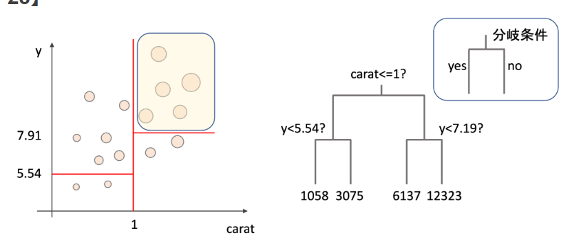

2章まで終了
# テスト作成
## このファイルはテストです
# ランク1の見出し
## ランク2の見出し

# 箇条書きPart1
- 1
- 2

* 1
* 2

## 箇条書きPart2
1. 1番目
2. 2番目
1. 3
1. 4

## 表の作成
|摘要 |内容
|-- |--
で表を作成

|摘要 |内容物
|-- |--
|資料１ |100 150
|資料２ |200 250
|資料３ |300 350
|資料４ |400 450
|資料５ |500

## 画像の挿入
